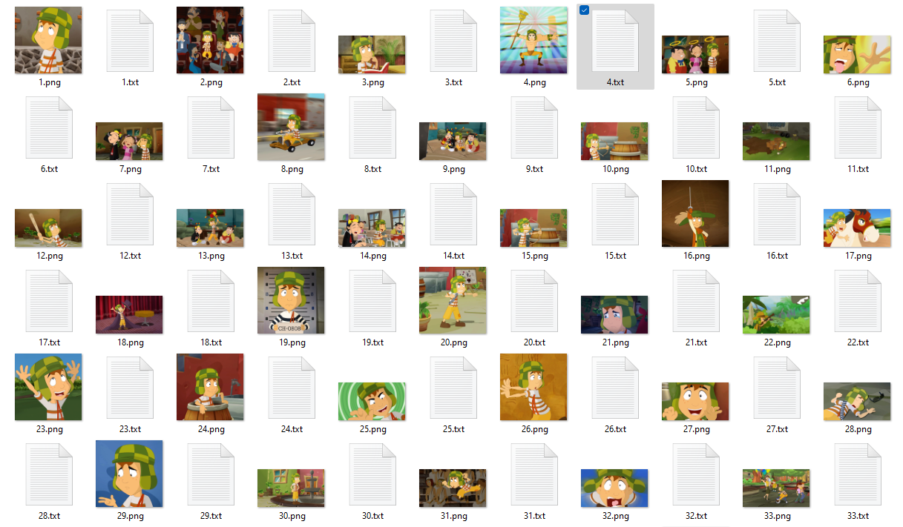
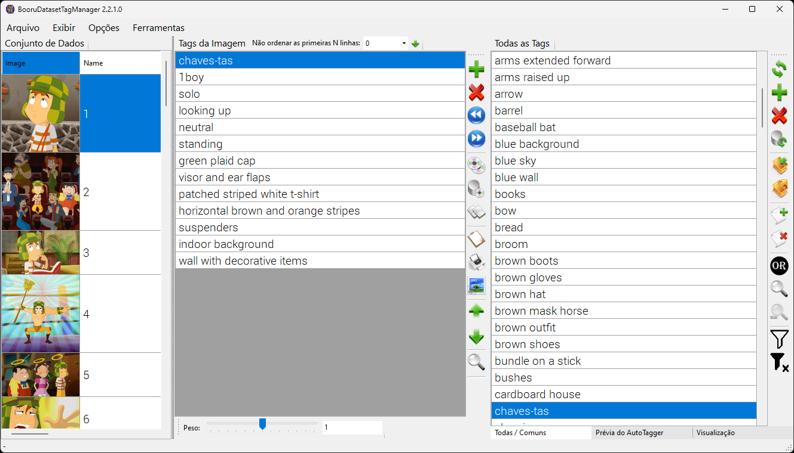
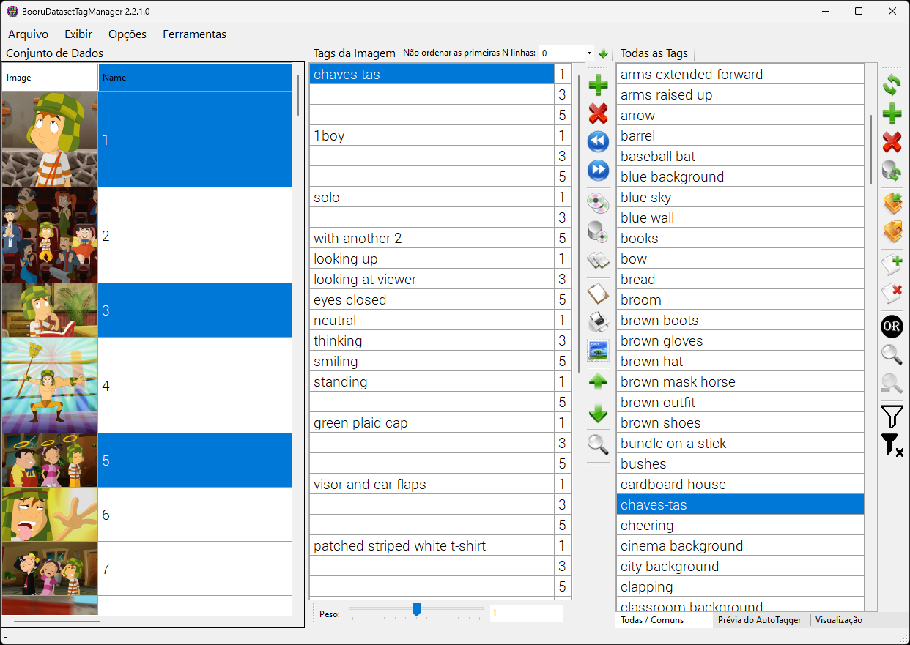
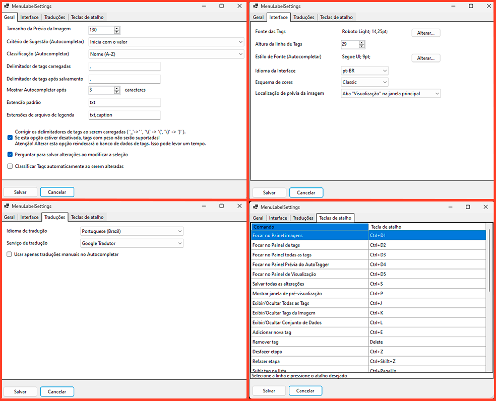
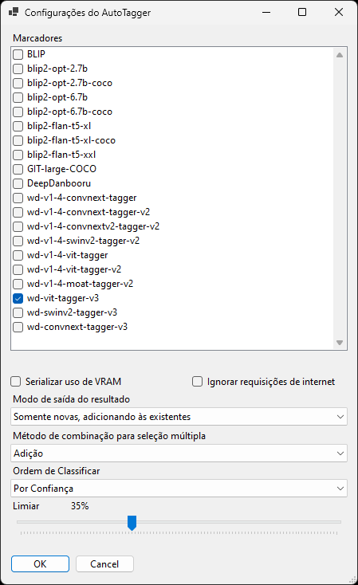

<div align="center">

[English](../../README.md) | [中文简体](../../README_zh_CN.md) | **Português do Brasil**

</div>

# BooruDatasetTagManager
Um editor de tags simplificado para conjunto de dados usados no treinamento de hiper-redes, embeddings, LoRA, etc. Crie um conjunto de dados do zero usando apenas imagens ou edite um conjunto de dados pré-existente, criado com tags automáticas ([wd14-tagger](https://github.com/toriato/stable-diffusion-webui-wd14-tagger), [stable-diffusion-webui](https://github.com/AUTOMATIC1111/stable-diffusion-webui), etc.).
Embora seja voltado para dados com tags no estilo booru, você pode adaptá-lo para outros tipos de conjunto de dados.

# Como Usar
Você precisará de um conjunto de dados com a seguinte estrutura:



*Caso deseje criar tags do zero, é possível especificar um conjunto de dados sem arquivos de texto. Os arquivos de texto serão criados ao salvar.*

No programa, selecione "Arquivo -> Carregar pasta" e indique o diretório do conjunto de dados.



O painel esquerdo exibe as imagens do conjunto de dados. O painel central exibe as tags das imagens selecionadas, que podem ser editadas. O painel direito possui duas abas. A primeira aba exibe todas as tags (ou as mais comuns) presentes no conjunto de dados. Na segunda aba, você pode gerar tags usando o serviço integrado (interrogator_rpc).

Após as edições, selecione "Arquivo -> Salvar Alterações".

# Multi Seleção

É possível selecionar várias imagens ao mesmo tempo. Isso facilita a edição de tags para imagens do mesmo tipo.



# Configurações do Programa

No menu "Opções", acesse a janela de "Configurações" para personalizar o programa. Usuários com o Google Tradutor bloqueado podem alterar o serviço de tradução para chinês. Na aba "Interface do Usuário", selecione um esquema de cores. Na aba "Teclas de Atalho", configure o layout de teclas desejado.



# Tradução de Tags

Antes de usar a tradução de tags, selecione o idioma e o serviço de tradução nas configurações.
No menu "Exibir", selecione "Traduzir Tags" para mostrar a coluna contendo as tags traduzidas. Dessa forma, todas as tags serão automaticamente traduzidas para o idioma selecionado. A tradução é salva na pasta "Translations" com o nome do idioma. Você pode editar manualmente as traduções neste arquivo, pois ele tem prioridade. Recomenda-se marcar as traduções manuais com o símbolo "*".

Exemplo de arquivo de tradução:

```
// Formato da tradução: <original>=<tradução>
black hair=cabelo preto
*solo=Sozinho
1girl=1garota
```

Atualmente, o filtro de tradução manual só funciona no modo Autocompletar (com a opção habilitada nas configurações). No futuro, poderá ser usado em outros locais.

# Lista de Tags para o Autocompletar

O programa permite carregar tags de arquivos CSV no formato usado em "[Booru tag autocompletion for A1111](https://github.com/DominikDoom/a1111-sd-webui-tagcomplete)". Você também pode criar seus próprios arquivos TXT com uma lista de tags (uma por linha). No entanto, como carregar dados desses arquivos demora, o programa os converte para seu próprio formato. Portanto, se você alterar a lista de tags, esteja preparado para um longo tempo de espera. Todos os arquivos com tags estão localizados na pasta "Tags".

# AutoTagger (interrogator_rpc)

Gere tags para imagens diretamente no programa. Para isso, configure e execute o serviço "interrogator_rpc". O Python deve estar instalado para que ele seja executado.
Para instalar as dependências do interrogator_rpc, execute o comando:

```shell
pip install -r requirements.txt
```

Para iniciar o serviço, execute:

```shell
python main.py
```

Caso encontre problemas para executar o serviço no Python Standalone, experimente usar o [Anaconda](https://www.anaconda.com/download) ou o [Miniconda](https://docs.conda.io/projects/miniconda/en/latest/).

Após a instalação do Anaconda (ou do Miniconda), abra o terminal, crie um novo ambiente conda e instale todas as dependências necessárias.

```shell
#Crie um novo ambiente com python
conda create -n bdtm python=3.10.9
#Ative o ambiente criado
conda activate bdtm
#Instale as dependências necessárias.
pip install -r requirements.txt
#Execute o serviço
python main.py
```

Para iniciar o serviço em um ambiente já configurado, abra o terminal e execute os seguintes comandos:

```shell
conda activate bdtm
python main.py
```

Após iniciar o serviço, no BooruDatasetTagManager, gere tags para todas as imagens através do menu "Ferramentas", ou para imagens selecionadas usando o ícone  no painel "Prévia do AutoTagger". Para configurar os parâmetros de geração, use o item de menu correspondente ou acesse "Opções" -> "Configurações do AutoTagger".



O AutoTagger permite selecionar vários modelos ao mesmo tempo e especificar um método para combinar os resultados.

# Tags com Pesos

O BooruDatasetTagManager é possível trabalhar com pesos nas tags. Ao carregar as tags, os colchetes são automaticamente convertidos em pesos. Para alterar o peso de uma tag, selecione-a e mova a barra de controle "Peso" para a posição do número desejado. Uma posição equivale a um colchete.

# Esquema de Cores

Atualmente, o programa oferece dois esquemas de cores (Clássico e Escuro). Você pode criar ou alterar o esquema de cores manualmente. Ainda não há um editor de esquema de cores baseado em janela, mas você pode abrir o arquivo ColorScheme.json em um editor de texto e fazer as alterações necessárias.

## Tradução da Interface

Traduza a interface do BooruDatasetTagManager para o seu idioma. Para isso:

1. Acesse o **diretório de idiomas** (`Languages`).
2. Crie um arquivo de texto (TXT) com o código do seu idioma (por exemplo, `pt-BR.txt`). Consulte a [lista de códigos de idioma](https://learn.microsoft.com/en-us/openspecs/office_standards/ms-oe376/6c085406-a698-4e12-9d4d-c3b0ee3dbc4a) para encontrar o código correto.
3. Traduza o conteúdo do arquivo, seguindo o formato `StringOriginal=sua_tradução`.
4. Compartilhe sua tradução conosco! Crie um tópico em "Issues" ou "Discussões" e anexe o arquivo.

Sua tradução será incluída na próxima versão do BooruDatasetTagManager.

# Compilação

Esta ferramenta foi projetada em C e você precisará executá-la no Visual Studio (não no Visual Studio Code). As etapas para fazer isso são:

1.  Baixe o [Visual Studio](https://visualstudio.microsoft.com/downloads/)
2.  Clone este repositório em uma pasta em seu computador
3.  Abra o repositório usando o Visual Studio: `Arquivo` > `Abrir` > `Projeto/Solução...` > selecione o arquivo `BooruDatasetTagManager.sln`
4.  Compile a solução selecionando `Compilação` > `Compilar Solução` no menu (ou pressionando Ctrl+Shift+B).
5.  Inicie o BooruDatasetTagManager em `Depurar` > `Iniciar Sem Depurar` (ou pressionando ctrl+F5).

Obs: Também é possível iniciar o programa diretamente pelo arquivo `BooruDatasetTagManager.exe` na pasta `./BooruDatasetTagManager/bin/Debug/net6.0-windows/`.

# Outros Recursos

Use o menu "Exibir" para ocultar painéis desnecessários.
No menu "Ferramentas", há uma função para substituir automaticamente o fundo transparente das imagens selecionadas pela cor que desejar.